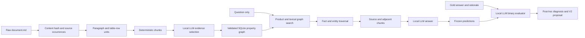

# BOAZ Korean Finance GraphRAG — V1

A complete, reproducible, local-LLM pipeline from Korean finance `document.md` files to a persisted property graph, GraphRAG answers, binary benchmark evaluation, and error analysis. V1 favors an auditable baseline over extensive optimization. The code does not call an external LLM API.

## Deliverables

- [English ontology and rationale](docs/ontology.md)
- [Extraction JSON schema](schemas/extraction.schema.json)
- Persisted property graph: `artifacts/v1/graph.sqlite`
- Portable graph: `artifacts/v1/graph_export/nodes.jsonl` and `edges.jsonl`
- Evaluation report: `artifacts/v1/reports/evaluation_report.md`
- Per-question results: `artifacts/v1/reports/per_question.csv` and `reports/questions/*.md`
- Structured results and error analysis: `artifacts/v1/evaluation/*.json*`
- Reusable source units/chunks and all raw LLM requests/responses: `artifacts/v1/corpus`, `extraction`, `llm`, `retrieval`

The report is generated only after all answers and binary judgments are complete. Consult the stage logs while a first run is still in progress; the existence of this README does not imply evaluation has finished.



## Environment

Development and outputs are confined to this new project. Existing source documents, benchmark files, model weights, and the reference MLX project are read-only inputs. A new isolated conda environment is stored in `.conda`; it was cloned from the working `mlx-lm` environment to avoid altering any existing environment or downloading model weights. The installed MLX package is a non-editable installation. The reference source location and exact revision are recorded in `environment_manifest.json`.

On this machine, the environment has already been created. Run commands from the project directory:

```bash
cd /Users/joonyeongs/Projects/BOAZ/finance_graphrag_v1
.conda/bin/python -m unittest discover -s tests -v
```

To recreate the environment using the reference installation:

```bash
conda create --prefix .conda --clone /Users/joonyeongs/anaconda3/envs/mlx-lm --offline -y
.conda/bin/python -m pip install --no-deps --no-build-isolation -e .
```

For a clean setup on a compatible Apple-silicon machine:

```bash
conda create --prefix .conda python=3.12 pip -y
.conda/bin/python -m pip install -r requirements.local.lock.txt
.conda/bin/python -m pip install --no-deps --no-build-isolation -e .
```

The lock file records the reference MLX source path, which must exist or be replaced with a checkout of the recorded revision. The model must be available locally at the `model_path` in `config.json`. No model download or external API is triggered automatically. Model identity, revision, inference settings, and package versions are recorded. MLX floating-point/GPU behavior can vary across hardware and package builds; exact cached responses reproduce the reported run.

## Configuration

`config.json` controls dataset paths, output directory, model snapshot, deterministic chunk sizes, stage batch sizes, and retrieval budgets. The benchmark path is only read by the question projection adapter and post-generation evaluator. The extraction and retrieval implementations never read gold fields.

The default corpus has 30 product directories and 121 `document.md` occurrences. Exact-content deduplication retains 58 document versions. Raw paragraphs and HTML table rows become 2,891 source units grouped into 180 chunks. Page comments and character spans are retained. Table rowspan/colspan values are expanded with parent-table provenance. Raw documents are stored inside the persisted graph so QA can continue after the original dataset moves.

Use a new `artifact_dir` for a modified corpus, ontology, prompt, model, or retrieval configuration. A frozen V1 run refuses implementation/graph changes. Generation cache keys include stage, prompt, model revision, sampling settings, token limit, and batch size. An interrupted batch is recomputed; completed batches are reused. Invalid JSON or source references receive at most two primary-model repair attempts. Only remaining failed chunks may then use the configured alternate local model (Qwen3.6) with at most one format repair; failures remain explicit. This bounded local fallback does not call a remote API.

## Run the complete pipeline

```bash
.conda/bin/python -u -m finance_graph all
# Equivalent:
./scripts/run_all.sh
```

The first run ingests documents, extracts all chunks with the local LLM, validates and persists the graph, exports question-only inputs, freezes V1, generates all answers, evaluates every answer, diagnoses failures, and writes reports. Running `all` again resumes a frozen run with its existing graph and cached generations. Source changes or modifications to frozen system files require a new output directory. Full local inference can take a substantial amount of time; progress is printed after each batch.

Individual stages are available for inspection or controlled execution:

```bash
.conda/bin/python -m finance_graph ingest
.conda/bin/python -u -m finance_graph extract
.conda/bin/python -m finance_graph build-graph
.conda/bin/python -m finance_graph validate
.conda/bin/python -m finance_graph questions
.conda/bin/python -m finance_graph freeze
.conda/bin/python -u -m finance_graph qa
.conda/bin/python -u -m finance_graph evaluate
.conda/bin/python -u -m finance_graph diagnose
.conda/bin/python -m finance_graph report
```

Only run construction stages before freezing. An incomplete graph cannot be published as a successful full build. Evaluation refuses partial answer sets and requires exactly the benchmark IDs. Malformed evaluator responses do not silently turn into numerical scores.

## QA with the persisted graph

These commands do not rebuild or re-extract anything:

```bash
.conda/bin/python -m finance_graph retrieve 'KB Global Star 적금의 가입대상은 누구인가요?'
.conda/bin/python -m finance_graph ask 'KB Global Star 적금의 가입대상은 누구인가요?'
```

`retrieve` prints selected facts, source chunks, product matches, and graph traversal routes without loading a model. `ask` additionally uses the local model to produce a Korean answer with source IDs. Short citation aliases in model context are mapped back to canonical graph IDs in the answer and retrieval trace. Returned statements represent this document snapshot, not independently verified current financial advice.

A different config can be selected before the stage name:

```bash
.conda/bin/python -m finance_graph --config config_v2.json all
```

## Storage and design choices

SQLite was selected instead of Neo4j for the first version: it gives transactional persistence, foreign-key validation, explicit typed edges, and repeatable traversal without a background service. Nodes and edges can be exported or imported into another property-graph engine later. No graph embeddings or model training are needed.

Every semantic fact is one of Rule, Condition, Requirement, Benefit, or Restriction. The local model supplies its Korean label, fact type, and selected source-unit IDs. The pipeline assembles the statement verbatim from those units, preserving rates, dates, limits, and qualifications. This is deliberately coarser than an executable logical representation. Numeric operators, condition groups, exception precedence, and validity intervals are potential V2 extensions, subject to observed failures.

Retrieval starts with the question alone and performs Korean character n-gram BM25 and product-name matching over graph nodes. It traverses product/source/document scope, shared entity mentions, fact evidence, and adjacent chunks. Full source text supplements graph facts. V1 is a hybrid GraphRAG baseline. A text-only comparison was not part of this first run; the measured accuracy alone cannot establish a causal benefit from graph structure.

## Evaluation and limitations

The benchmark adapter writes only `id` and `question`. Answers, rationales, aliases, difficulty, source paths, evidence, and product annotations are excluded from all inference prompts. After every prediction is saved and hashed, the local LLM evaluator receives the reference answer/rationale and prediction and returns a binary judgment. Post-hoc source matching and failure diagnosis then inspect the benchmark evidence and stored graph.

The same local model weights serve generation and evaluation with separate stateless prompts. Model-judge bias remains possible. Error categories are evidence-informed diagnoses, not causal experiments. Annotated-document recall and evidence-bigram coverage are diagnostics, not grading substitutes. The original binary score remains unchanged even when a diagnostic suspects a judge error. A second judge/human audit and a held-out V2 comparison are recommended follow-ups when supported by the report.

No unlimited recursive optimization is implemented. The report proposes a bounded V2 plan, but does not automatically apply it. A switch to a remote API requires explicit user permission and a separate, reviewed backend implementation; the current backend rejects such configuration.

## References

- [MLX LM official repository](https://github.com/ml-explore/mlx-lm): local loading, batch inference, and sampling API; the installed source was inspected for exact signatures.
- [Upstage API setup documentation](https://console.upstage.ai/docs/getting-started): supplied by the user as a possible fallback reference. The remote API was not used.
