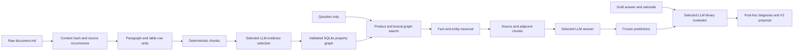

# BOAZ Korean Finance GraphRAG — V1

A complete, auditable pipeline from Korean finance `document.md` files to a persisted property graph, GraphRAG answers, binary benchmark evaluation, and error analysis. V1 favors an auditable baseline over extensive optimization. Local MLX inference is the default; Upstage Solar API inference is selectable.

## Select local or API inference

The original `config.json` defaults to `local_mlx`; the portable `config.api.example.json` defaults to `upstage`. To use Upstage, paste **only the API key** as one line of plain text into `.secrets/upstage_api_key` (no quotes or variable assignment). Create the directory/file if needed. The entire `.secrets/` directory is git-ignored; credentials are loaded only when a request is needed and are not put in configuration, cache records, or reports. Do not put keys in `config.json`.

For a new checkout, follow the [API-only environment setup](#api-only-environment-recommended-for-other-users) below. Commands use the Python from your activated environment.

The `api` object in `config.json` sets the endpoint, model (`solar-pro4`), reasoning effort (`medium`), key-file location (relative to this repository), and timeout. These defaults follow the [Upstage API example](https://console.upstage.ai/api-keys). Set `backend` in that file or override it before the command:

```bash
# Fresh live API call each time; expected answer: $70.40
python -m finance_graph --config config.user.json --backend upstage llm-test

# Build and evaluate an API run (sends pipeline prompts/source context to Upstage)
python -m finance_graph --config config.user.json --backend upstage all

# Select local inference with a fresh output directory
python -m finance_graph --config config.user.json --backend local_mlx --artifact-dir artifacts/local_v2 all

# Ask using the existing V1 graph and the API
python -m finance_graph --config config.user.json --backend upstage --artifact-dir artifacts/v1 ask '가입 조건은?'
```

API runs default to the configured artifact directory plus `_upstage` (e.g. `artifacts/v1_upstage`); set `api_artifact_dir` or pass `--artifact-dir` to override it. API generation caches include endpoint, model, reasoning effort, prompt, stage, and token limit. The API model revision is provider-managed, so cached results preserve the observed response but fresh calls may change. `llm-test` bypasses API cache. Transport retries are bounded; invalid structured outputs use the existing bounded repair flow. API extraction does not load the alternate local model. Evaluation metadata and reports record the chosen provider/model.

Existing frozen benchmark runs reject changed code/configuration; use a fresh artifact directory to rerun the benchmark after this update. Interactive `ask` can still use an existing graph. The original results below describe the historical local V1 run.


## Deliverables

- [Comprehensive repository guide](docs/repository_guide.md) — architecture, setup, configuration, commands, data contracts, evaluation, and troubleshooting.
- [English ontology and rationale](docs/ontology.md)
- [Extraction JSON schema](schemas/extraction.schema.json)
- [V1 execution and parser amendments](docs/v1_implementation_notes.md)
- [Bounded V2 proposal](docs/v2_proposal.md)
- Persisted property graph: `artifacts/v1/graph.sqlite`
- Portable graph: `artifacts/v1/graph_export/nodes.jsonl` and `edges.jsonl`
- Evaluation report: `artifacts/v1/reports/evaluation_report.md`
- Per-question results: `artifacts/v1/reports/per_question.csv` and `reports/questions/*.md`
- Structured results and error analysis: `artifacts/v1/evaluation/*.json*`
- Reusable source units/chunks and all raw LLM requests/responses: `artifacts/v1/corpus`, `extraction`, `llm`, `retrieval`

The report is generated only after all answers and binary judgments are complete. Consult the stage logs while a first run is still in progress; the existence of this README does not imply evaluation has finished.



## Environment

Run setup from your cloned repository directory with Python 3.12 or newer. Use an editable install: prompts, schemas, and configuration live in the checkout and are not bundled into a standalone wheel.

### API-only environment (recommended for other users)

No MLX, model weights, GPU, or conda installation is needed. Create a dedicated environment:

```bash
python3.12 -m venv .venv-api
source .venv-api/bin/activate
python -m pip install --upgrade pip
python -m pip install -e .
cp config.api.example.json config.user.json
python -c "from pathlib import Path; Path('.secrets').mkdir(exist_ok=True); Path('.secrets/upstage_api_key').touch(exist_ok=True)"
```

On Windows PowerShell, use `py -3.12 -m venv .venv-api`, activate with `.venv-api\Scripts\Activate.ps1`, and copy with `Copy-Item config.api.example.json config.user.json`. The remaining `python` commands are the same.

Paste only your Upstage API key into `.secrets/upstage_api_key` as plain text (no quotes or variable assignment). Both `.secrets/` and `config.user.json` are git-ignored. The checked-in `config.json` retains the original author's personal paths as reference examples; new users should use their own `config.user.json`.

Edit `config.user.json` to point `dataset_root` at your parsed documents and `benchmark_path` at your benchmark. The portable example expects:

```text
data/
  documents/
    product-name/
      document-name/
        document.md
  benchmark.json
```

These inputs are not included in Git. `data/`, `models/`, and generated artifacts are ignored. Every configured filesystem path is relative to the repository root unless it is absolute; `~` is expanded. This applies even when a custom config lives elsewhere. The `--config` filename itself is relative to your current working directory. Model paths are unused in API mode. The benchmark format is described in the [repository guide](docs/repository_guide.md#12-benchmark-evaluation-and-diagnosis).

Verify installation and credentials before running the full pipeline:

```bash
python -m unittest discover -s tests -v
python -m finance_graph --config config.user.json llm-test
python -m finance_graph --config config.user.json all
python -m finance_graph --config config.user.json ask '가입 조건은?'
```

`llm-test` needs only the key; it does not require documents, a benchmark, or a graph. `all` requires both documents and a benchmark and sends prompts to Upstage. `ask` requires a previously built graph. API outputs default to `artifacts/v1_upstage`; choose a fresh directory for changed benchmark systems. Put options such as `--config`, `--backend`, and `--artifact-dir` before the command.

### Separate optional local environment

Local MLX inference requires a compatible Apple Silicon Mac and existing model files. Keep its dependencies separate from the API environment:

```bash
deactivate
python3.12 -m venv .venv-local
source .venv-local/bin/activate
python -m pip install -e '.[local]'
python -m finance_graph --config config.user.json --backend local_mlx --artifact-dir artifacts/local_run llm-test
```

Before the final command, set `model_path`, `model_id`, and `model_revision` in your config to the local model you actually have. Configure the alternate extraction model too, or set `local_extraction_fallback` to `null`. Local mode does not download weights or fall back to a hosted API. To switch back, deactivate and activate `.venv-api` again. The existing `.conda` environment is unaffected.

`environment_manifest.json`, `conda-explicit.txt`, and `requirements.local.lock.txt` record the historical Apple Silicon V1 environment. They are not API setup requirements. The local lock now uses a versioned MLX LM package instead of a personal checkout; exact historical source identity is retained in the manifest.

## Configuration

Your selected config controls dataset paths, output directory, model snapshot, deterministic chunk sizes, stage batch sizes, and retrieval budgets. The benchmark path is only read by the question projection adapter and post-generation evaluator. The extraction and retrieval implementations never read gold fields.

The historical V1 corpus had 30 product directories and 121 `document.md` occurrences. Exact-content deduplication retains 58 document versions. Raw paragraphs and HTML table rows become 2,891 source units grouped into 180 chunks. Page comments and character spans are retained. Table rowspan/colspan values are expanded with parent-table provenance. Raw documents are stored inside the persisted graph so QA can continue after the original dataset moves.

Use a new `artifact_dir` for a modified corpus, ontology, prompt, model, or retrieval configuration. A frozen V1 run refuses implementation/graph changes. Generation cache keys include stage, prompt, model revision, sampling settings, token limit, and batch size. An interrupted batch is recomputed; completed batches are reused. The final answer parser accepts exact citation IDs in optional display brackets, reads the last complete model-emitted answer JSON, and records an omitted auxiliary `insufficient_evidence` flag as `null` (unreported). Invalid JSON or source references receive at most two primary-model repair attempts. Only remaining failed chunks may then use the configured alternate local model (Qwen3.6) with at most one format repair; failures remain explicit. This bounded local fallback does not call a remote API.

## Run the complete pipeline

```bash
./scripts/run_all.sh config.user.json
# Core pipeline without the supplemental post-evaluation audit:
python -u -m finance_graph --config config.user.json all
```

The wrapper also runs `scripts/post_evaluation_audit.py` after evaluation; it adds quote-only diagnostic metrics and the preserved manual review without changing answers or grades. The core first run ingests documents, extracts all chunks with the selected LLM, validates and persists the graph, exports question-only inputs, freezes V1, generates all answers, evaluates every answer, diagnoses failures, and writes reports. Running `all` again resumes a frozen run with its existing graph and cached generations. Source changes or modifications to frozen system files require a new output directory. Full local inference can take a substantial amount of time; progress is printed after each batch.

Individual stages are available for inspection or controlled execution:

```bash
python -m finance_graph --config config.user.json ingest
python -u -m finance_graph --config config.user.json extract
python -m finance_graph --config config.user.json build-graph
python -m finance_graph --config config.user.json validate
python -m finance_graph --config config.user.json questions
python -m finance_graph --config config.user.json freeze
python -u -m finance_graph --config config.user.json qa
python -u -m finance_graph --config config.user.json evaluate
python -u -m finance_graph --config config.user.json diagnose
python -m finance_graph --config config.user.json report
```

Only run construction stages before freezing. An incomplete graph cannot be published as a successful full build. Evaluation refuses partial answer sets and requires exactly the benchmark IDs. Malformed evaluator responses do not silently turn into numerical scores.

## QA with the persisted graph

These commands do not rebuild or re-extract anything:

```bash
python -m finance_graph --config config.user.json retrieve 'KB Global Star 적금의 가입대상은 누구인가요?'
python -m finance_graph --config config.user.json ask 'KB Global Star 적금의 가입대상은 누구인가요?'
```

`retrieve` prints selected facts, source chunks, product matches, and graph traversal routes without loading a model. `ask` additionally uses the selected model to produce a Korean answer with source IDs. Short citation aliases in model context are mapped back to canonical graph IDs in the answer and retrieval trace. Returned statements represent this document snapshot, not independently verified current financial advice.

A different config can be selected before the stage name:

```bash
python -m finance_graph --config config_v2.json all
```

## Storage and design choices

SQLite was selected instead of Neo4j for the first version: it gives transactional persistence, foreign-key validation, explicit typed edges, and repeatable traversal without a background service. Nodes and edges can be exported or imported into another property-graph engine later. No graph embeddings or model training are needed.

Every semantic fact is one of Rule, Condition, Requirement, Benefit, or Restriction. The selected model supplies its Korean label, fact type, and selected source-unit IDs. The pipeline assembles the statement verbatim from those units, preserving rates, dates, limits, and qualifications. This is deliberately coarser than an executable logical representation. Numeric operators, condition groups, exception precedence, and validity intervals are potential V2 extensions, subject to observed failures.

Retrieval starts with the question alone and performs Korean character n-gram BM25 and product-name matching over graph nodes. It traverses product/source/document scope, shared entity mentions, fact evidence, and adjacent chunks. Full source text supplements graph facts. V1 is a hybrid GraphRAG baseline. A text-only comparison was not part of this first run; the measured accuracy alone cannot establish a causal benefit from graph structure.

## Evaluation and limitations

The benchmark adapter writes only `id` and `question`. Answers, rationales, aliases, difficulty, source paths, evidence, and product annotations are excluded from all inference prompts. After every prediction is saved and hashed, the selected LLM evaluator receives the reference answer/rationale and prediction and returns a binary judgment. Post-hoc source matching and failure diagnosis then inspect the benchmark evidence and stored graph.

The same configured model serves generation and evaluation with separate stateless prompts. Model-judge bias remains possible. Error categories are evidence-informed diagnoses, not causal experiments. Annotated-document recall and evidence-bigram coverage are diagnostics, not grading substitutes. The original binary score remains unchanged even when a diagnostic suspects a judge error. A second judge/human audit and a held-out V2 comparison are recommended follow-ups when supported by the report.

No unlimited recursive optimization is implemented. The report proposes a bounded V2 plan, but does not automatically apply it. Select `--backend upstage` explicitly to use the external API. Local mode never falls back to a remote API.

## References

- [MLX LM official repository](https://github.com/ml-explore/mlx-lm): local loading, batch inference, and sampling API; the installed source was inspected for exact signatures.
- [Upstage API setup documentation](https://console.upstage.ai/docs/getting-started): API configuration reference. The historical V1 benchmark used local inference.
