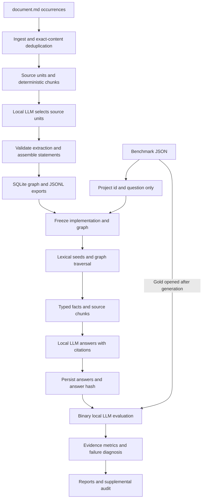
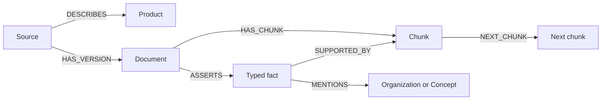

# Finance GraphRAG V1 — Repository Guide

Comprehensive developer and operator documentation for `boaz-finance-graphrag` 0.1.0.

**Reviewed:** 2026-09-16. **Code baseline:** `c936465` (`Clarify diagnostic metric definitions and reviewed failure examples`). This guide describes the inspected implementation and locally available V1 artifacts. Recorded benchmark results come from the completed 2026-09-13 run; documentation verification did not rerun model inference.

## Contents

1. [Purpose and boundaries](#1-purpose-and-boundaries)
2. [Repository map](#2-repository-map)
3. [Architecture and execution lifecycle](#3-architecture-and-execution-lifecycle)
4. [Environment and installation](#4-environment-and-installation)
5. [Configuration reference](#5-configuration-reference)
6. [Command reference and operating recipes](#6-command-reference-and-operating-recipes)
7. [Ingestion and source provenance](#7-ingestion-and-source-provenance)
8. [Extraction and local inference](#8-extraction-and-local-inference)
9. [Ontology and SQLite storage](#9-ontology-and-sqlite-storage)
10. [Retrieval algorithm](#10-retrieval-algorithm)
11. [Answer generation and citation contracts](#11-answer-generation-and-citation-contracts)
12. [Benchmark evaluation and diagnosis](#12-benchmark-evaluation-and-diagnosis)
13. [Artifact reference](#13-artifact-reference)
14. [Freezing, caching, and reproducibility](#14-freezing-caching-and-reproducibility)
15. [Recorded V1 results](#15-recorded-v1-results)
16. [Python interfaces and inspection examples](#16-python-interfaces-and-inspection-examples)
17. [Verification and test coverage](#17-verification-and-test-coverage)
18. [Troubleshooting](#18-troubleshooting)
19. [Maintenance and extension guide](#19-maintenance-and-extension-guide)
20. [Known limits and companion documents](#20-known-limits-and-companion-documents)

## 1. Purpose and boundaries

The repository converts Korean financial product documents into a persistent property graph, uses that graph together with source text to answer Korean questions, and evaluates the answers against a benchmark. The implementation emphasizes inspectable evidence: every stored semantic fact is assembled from identified source units, and every generated answer cites evidence supplied in its context.

The application is a Python command-line pipeline with a small importable library. Its model backend supports Upstage API inference and optional local MLX inference. SQLite stores the graph; lexical BM25 and graph traversal provide retrieval. There is no web application, HTTP service, vector database, embedding pipeline, training loop, or implemented V2 calculator.

The graph is a collection of evidence-bound assertions, not an executable financial rule engine. Arithmetic, date calculations, exception selection, and condition application are currently performed by the answer model. Answers describe the ingested document snapshot. The pipeline does not fetch updated financial terms or independently verify their present-day validity.

### Inputs and outputs

| Item | Contract |
|---|---|
| Corpus | A directory recursively containing UTF-8 files named exactly `document.md`. The first path component below the corpus root identifies the product. |
| Benchmark | A JSON list of question records. Question projection uses `id` and `question`; evaluation subsequently requires `answer` and `rationale`. |
| Model | Locally available weights and tokenizer at the configured snapshot path. |
| Main output | `graph.sqlite`, extracted facts, retrieval traces, answers, judgments, reports, and raw model generation records under `artifact_dir`. |
| Inference boundary | Extraction and retrieval do not consume benchmark reference answers. QA reads a projection containing exactly `id` and `question`. |

Document content and prompt templates discussed in this guide describe the application. They are repository reference material, not additional instructions for maintaining or documenting the repository.

## 2. Repository map

```text
finance_graphrag_v1/
├── README.md                         # Quick start and design overview
├── pyproject.toml                    # Package metadata and console entry point
├── config.json                       # Default local paths and pipeline settings
├── environment_manifest.json         # Recorded development runtime and revision
├── requirements.local.lock.txt       # Pinned Python environment; local MLX source path
├── conda-explicit.txt                # Recorded Conda package specification
├── finance_graph/
│   ├── __main__.py                   # python -m finance_graph entry point
│   ├── cli.py                        # Command dispatch and stage ordering
│   ├── common.py                     # JSON I/O, hashing, IDs, normalization, config
│   ├── ingest.py                     # Source discovery, parsing, units, chunks
│   ├── llm.py                        # Local MLX generation, caching, bounded repairs
│   ├── extract.py                    # Source-unit selection and fact validation
│   ├── graph.py                      # Graph construction, loading, validation
│   ├── benchmark.py                  # Strict question-only projection
│   ├── retrieve.py                   # BM25, graph expansion, context assembly
│   ├── qa.py                         # Freeze checks, batch and interactive answers
│   ├── evaluate.py                   # Binary judgments and post-hoc diagnostics
│   └── report.py                     # Markdown reports and CSV generation
├── prompts/{extract,answer,evaluate,diagnose}.txt
├── schemas/extraction.schema.json    # Declarative extraction response schema
├── scripts/
│   ├── run_all.sh                    # Full pipeline followed by supplemental audit
│   ├── post_evaluation_audit.py       # Quote-only metrics and preserved manual review
│   └── pilot.py                      # Standalone local-model smoke experiment
├── tests/test_pipeline.py            # Unit tests and synthetic integration fixture
├── docs/
│   ├── repository_guide.md           # This guide
│   ├── ontology.md                   # Conceptual schema and rationale
│   ├── v1_implementation_notes.md    # Historical parser amendments
│   ├── manual_error_review.json      # Preserved review of selected V1 failures
│   └── v2_proposal.md                # Proposed, unimplemented follow-up
├── artifacts/                       # Local run data, ignored by Git
│   └── v1/
└── .conda/                          # Local environment, ignored by Git
```

The checkout's `.gitignore` excludes environments, artifacts, logs, bytecode, egg metadata, `.DS_Store`, and `.env`. A fresh clone therefore does not include the graph, source corpus, model weights, or saved inference cache. The local checkout inspected for this guide does contain V1 artifacts.

## 3. Architecture and execution lifecycle



### First complete run

`all` calls the following stages in order:

```text
ingest → extract → build_graph → prepare_questions → freeze
       → answer_questions → evaluate → diagnose → report
```

`answer_questions` checks the freeze again before generating benchmark answers. `scripts/run_all.sh` runs `all`, then the supplemental post-evaluation audit. Each stage persists files needed by subsequent stages; the application has no background scheduler.

### Resuming an existing frozen run

When `run_freeze.json` exists, `all` skips corpus ingestion, extraction, graph rebuilding, and question projection. It re-reads each previously recorded source path to check its content hash, validates the graph, checks the freeze, then runs QA, evaluation, diagnosis, and reporting. Model calls reuse matching cached generations. Downstream manifests and reports may be rewritten even when all model responses come from cache.

The standalone `retrieve` and `ask` commands use the stored graph and do not perform this original-source check. They can operate after the input corpus has moved, provided the graph and, for generation, model dependencies remain available.

## 4. Environment and installation

Follow the [API-only environment setup in the README](../README.md#api-only-environment-recommended-for-other-users). It creates `.venv-api`, installs this checkout with `python -m pip install -e .`, and uses `config.api.example.json` as the template for your ignored `config.user.json`. The base install includes the API SDK and does not install MLX or NumPy. No model weights or GPU are required for API inference. Run the synthetic test suite and the live `llm-test` command before a full benchmark.

Local inference is optional: create `.venv-local` on a compatible Apple Silicon Mac and install `python -m pip install -e '.[local]'`. Supply your model snapshots and select `--backend local_mlx`. The historical environment manifest and local lock describe the original V1 runtime, not prerequisites for API users.

Commands below use `python` from the activated environment. Examples with `config.json` refer to the original author's reference configuration; replace it with `config.user.json` for your installation. Data, weights, and generated artifacts are not shipped in Git. Keep the editable checkout installation because prompts, ontology, and default configs live outside the Python package directory.

## 5. Configuration reference

API settings live under `api`: `base_url`, `model`, `reasoning_effort`, `key_file`, and `timeout_seconds`. Select with `--backend upstage` or your config. API runs use `api_artifact_dir` when set, otherwise `artifact_dir` plus `_upstage`; `--artifact-dir` overrides either. Model identity is taken from `api.model`; local fallback is disabled in API mode. The API client is loaded only for uncached requests. `llm-test` forces a fresh API call.

Source: [config.json](../config.json) and [`common.config`](../finance_graph/common.py).

`--config` selects a JSON file; there is no environment-variable configuration layer or comprehensive config-schema validator. Missing or malformed fields may fail at their point of use. All configured filesystem paths resolve relative to repository `ROOT`, including dataset, benchmark, model snapshots, API key, and artifacts. Absolute paths and `~` are also supported. This rule is independent of the config file location. The path given to `--config` itself is resolved by normal filesystem rules.

The path examples below are from `config.api.example.json`; `config.json` retains personal paths as a reference.

| Field | Shipped value | Purpose |
|---|---|---|
| `schema_version` | `"1.0"` | Manifest label; not a migration mechanism. |
| `dataset_root` | `data/documents` | Source discovery root. |
| `benchmark_path` | `data/benchmark.json` | Benchmark file for projection and evaluation. |
| `artifact_dir` | `artifacts/v1` | All stage outputs; resolved against repository root. |
| `backend` | `upstage` | API example default; `local_mlx` is also supported. |
| `model_id` | `mlx-community/gemma-4-26b-a4b-it-4bit` | Recorded primary model identity and cache input. |
| `model_revision` | `0d77464eeb233a2da68ebf9d7dc4edaac7db956d` | Recorded primary snapshot revision and cache input. |
| `model_path` | `models/gemma` (unused in API mode) | Files actually loaded; see config for the full path. |
| `seed` | `17` | MLX random seed at load and cache input. |
| `unit_max_chars` | `1700` | Long source-unit split limit. |
| `chunk_target_chars` | `3400` | Preferred chunk grouping threshold. |
| `chunk_max_chars` | `5600` | Grouping threshold used before adding the next unit. |
| `batch_size` | `8` | Generation batch-size fallback when a stage override is absent. |
| `extraction_max_tokens` | `2200` | Maximum completion tokens for extraction and its fallback. |
| `qa_max_tokens` | `1600` | Maximum completion tokens for batch and interactive QA. |
| `evaluation_max_tokens` | `900` | Maximum completion tokens for grading. |
| `context_max_chars` | `27000` | Approximate evidence-context budget; not a tokenizer limit. |
| `retrieval_chunks` | `10` | Initial chunk budget before adjacent expansion. |
| `retrieval_facts` | `28` | Initial fact budget before expansion. |
| `stage_batch_sizes` | See below | Override generation batching by stage name. |
| `local_extraction_fallback` | Qwen snapshot object | Optional alternate model for failed extraction chunks only. |

Stage overrides are extraction `8`, QA `3`, evaluation `8`, diagnosis `2`, interactive `1`, and extraction fallback `2`. Diagnosis uses a hard-coded `1100` completion-token limit. To disable alternate extraction, omit `local_extraction_fallback` or set it to a false-like value.

The shipped fallback identity is `mlx-community/Qwen3.6-35B-A3B-4bit`, revision `38740b847e4cb78f352aba30aa41c76e08e6eb46`. Its `model_id`, `model_path`, and `model_revision` override the corresponding primary settings only for failed extraction requests.

Batch sizes affect both memory usage and cache identity. Retrieval sizes are seed budgets rather than final guaranteed counts: expansion can add candidates, while context assembly can remove them. Character limits are heuristics; long headings and formatting overhead can exceed an apparent strict bound. Keep `unit_max_chars` comfortably below the chunk budget.

## 6. Command reference and operating recipes

Two entry points invoke the same dispatcher:

```bash
python -m finance_graph --config config.json COMMAND
finance-graph --config config.json COMMAND
```

Place `--config` before the subcommand. No CLI flags expose the Python-only partial extraction/QA limits. All commands instantiate `LocalLLM`, so an unsupported `backend` is rejected even for a command that does not load weights.

| Command | Prerequisites | Main effect | Loads weights? |
|---|---|---|---|
| `ingest` | Corpus | Writes products, sources, documents, units, chunks, manifest. Refuses a frozen run through CLI. | No |
| `extract` | Ingest outputs | Writes validated facts, per-chunk records, extraction status, model cache. Refuses a frozen run through CLI. | If uncached requests exist |
| `build-graph` | Complete extraction and corpus | Replaces graph, exports nodes/edges, writes validation report. Refuses a frozen run through CLI. | No |
| `validate` | Graph | Runs integrity checks; prints a JSON summary. Does not refresh `graph_validation.json`. | No |
| `questions` | Benchmark | Writes question-only projection and manifest. | No |
| `freeze` | Graph, corpus manifest, question manifest | Creates freeze record or verifies an existing one. | No |
| `qa` | Graph, manifests, projected questions | Checks freeze, writes retrieval traces and all answer records. | If uncached requests exist |
| `evaluate` | Complete hashed answers, unchanged benchmark | Writes binary judgments and score summary. | If uncached requests exist |
| `diagnose` | Results, retrieval traces, graph validation | Writes evidence metrics and diagnoses incorrect answers. | If uncached requests exist |
| `report` | Results, metrics, diagnoses, manifests | Writes aggregate/per-question Markdown and CSV. | No |
| `retrieve 'QUESTION'` | Graph | Prints evidence context and trace; no benchmark needed. | No |
| `ask 'QUESTION'` | Graph and local generation runtime | Returns validated answer, trace, request hash; caches generation. | If uncached request exists |
| `all` | Inputs for a first run; recorded inputs for resume | Executes construction or resume branch, then QA through report. | If uncached requests exist |

Some commands print stage progress before their final JSON. Do not assume every command's entire standard output is a single JSON document. For structured integration, call the Python interfaces or read the generated files.

### Inspect the existing graph without generation

```bash
python -m finance_graph validate
python -m finance_graph retrieve 'KB Global Star 적금의 가입대상은 누구인가요?'
```

### Ask an interactive question

```bash
python -m finance_graph ask 'KB Global Star 적금의 가입대상은 누구인가요?'
```

`ask` returns an object with `response`, `trace`, and `request_hash`. It does not append a benchmark answer row or write a benchmark retrieval file; its raw generation is cached under `llm/interactive/`.

### Reproduce or resume the shipped run

```bash
./scripts/run_all.sh
# Same core pipeline, without the supplemental audit:
python -u -m finance_graph all
```

A matching frozen run uses the existing graph and matching cache entries. A fresh run can take substantial local compute time. The wrapper uses `set -euo pipefail`, so it stops when a stage process fails.

### Create a separate experiment

Keep an existing frozen run as a reference. Generate a config with a separate output location, then edit input paths or settings as needed:

```bash
python - <<'PY'
import json
from pathlib import Path

cfg = json.loads(Path('config.json').read_text())
cfg['artifact_dir'] = 'artifacts/experiment_01'
with Path('config_experiment_01.json').open('x', encoding='utf-8') as stream:
    json.dump(cfg, stream, ensure_ascii=False, indent=2)
PY

python -u -m finance_graph --config config_experiment_01.json all
python scripts/post_evaluation_audit.py config_experiment_01.json
```

The audit assumes compatible completed benchmark artifacts; see its assumptions in [section 12](#12-benchmark-evaluation-and-diagnosis). The default config is itself included in freeze hashes, even when using a custom config.

### Run stages explicitly

```bash
python -m finance_graph ingest
python -u -m finance_graph extract
python -m finance_graph build-graph
python -m finance_graph questions
python -m finance_graph freeze
python -u -m finance_graph qa
python -u -m finance_graph evaluate
python -u -m finance_graph diagnose
python -m finance_graph report
```

This sequence is for an unfrozen output directory. Construction commands deliberately reject a frozen directory. The `questions` command does not have that same CLI guard, so regenerate projections only as part of a deliberately separate run.

## 7. Ingestion and source provenance

Source: [`ingest.py`](../finance_graph/ingest.py).

### Discovery, identity, and deduplication

1. Recursively discover `document.md` and sort by relative path.
2. Read UTF-8 text and hash it with SHA-256.
3. Create a `Source` occurrence for each relative path and a `Product` for the first relative path component.
4. Share a `Document` when read text has the same hash, even across different product directories.
5. Extract the title from the first line starting with `#`, falling back to the parent directory name.
6. Record literal date-like mentions without interpreting effective dates.

Hashes here apply to decoded text re-encoded as UTF-8, not directly to original file bytes. Python text reading can normalize line endings. The dataset hash covers ordered `(relative_path, text_hash)` pairs. Source modification time is retained as metadata but is not a validity date or part of document identity.

The intended layout is `dataset_root/product_name/.../document.md`. A file placed directly at the root will technically be accepted, but its first path component is the filename and will produce an unintended product name.

### Units

The parser separates HTML tables and comments such as `<!-- page: 2 -->` from ordinary Markdown. It recognizes standalone Markdown headings and uses them as unit context. Page numbering starts at 1 and changes when a page comment is encountered. Paragraph-like spans become source units; Markdown pipe tables are not parsed with the HTML-table expansion logic.

`TableParser` expands `rowspan` and `colspan` values. Table rows become logical units, adjacent repeated cell values are suppressed, and a short first-row header is prefixed to later rows. Long units are split near punctuation or whitespace, falling back to the length limit.

| Unit field | Meaning |
|---|---|
| `id`, `document_id` | Stable unit and owning-document IDs. |
| `ordinal` | Zero-based order within the document. |
| `text` | Parsed unit text used as evidence. |
| `heading`, `page` | Most recent heading and page context. |
| `raw_start`, `raw_end` | Character offsets into stored document text, using an exclusive end. |
| `table_row` | Optional zero-based logical table row index. |

Table-unit offsets point to the entire parent table because inherited cells/header text may originate elsewhere in it. Split parts of a long unit retain their parent span. Consequently, `raw_text[raw_start:raw_end]` need not equal the unit text. Fact statements preserve selected **unit text**, not necessarily an unchanged raw Markdown substring.

### Chunks

Units are grouped in document order without overlap. Before adding a unit, a chunk flushes when adding it would exceed the configured maximum, the current group already meets the target, or a heading changes after the group exceeds 70% of the target. Each chunk contains its unit IDs, page list, distinct headings, ordinal, document ID, and formatted text.

Chunk identity depends on document ID and ordered unit IDs. The chunker does not resolve cross-document contradictions or merge semantically similar versions. Chunk boundaries are deterministic for a fixed implementation, text, and configuration.

## 8. Extraction and local inference

Sources: [`extract.py`](../finance_graph/extract.py), [`llm.py`](../finance_graph/llm.py), [extraction prompt](../prompts/extract.txt), [JSON schema](../schemas/extraction.schema.json).

### Extraction contract

For each chunk, canonical unit IDs are mapped to short aliases `U1`, `U2`, and so on. The model receives the title and units with headings/pages. It chooses a fact type, short Korean name, and supporting aliases, optionally including entities. It does not author the persisted statement text.

Illustrative model response shape:

```json
{
  "facts": [
    {
      "type": "Condition",
      "name": "가입 조건",
      "units": ["U1", "U2"],
      "entities": [{"type": "Organization", "name": "원문에 존재하는 기관명"}]
    }
  ]
}
```

This example shows structure only; aliases and entities must actually exist in the request evidence.

Runtime validation requires a list of facts, allowed fact types, nonempty names, and at least one known unit alias per fact. Duplicate references are removed while preserving their first order. The pipeline assembles `statement` by joining the selected units with newlines.

Entity types are restricted to `Organization` and `Concept`. An entity name must occur in the selected statement after mechanical normalization via `key()`. Unsupported entities are placed in `rejected_entities`; they do not cause the whole fact to fail. An empty fact list is rejected when the chunk text exceeds 250 characters.

The JSON schema is a reference document. The code does not load it or invoke a JSON Schema validator. The prompt's preference for zero to two entities and complete useful-fact coverage is not a strict runtime cardinality/completeness check. Valid structure and existing source references do not prove that the chosen type or combined evidence is semantically correct.

### Generation behavior

`LocalLLM` lazily loads the configured local model and tokenizer. It sets the MLX seed, formats a single user message with the tokenizer's chat template, and disables thinking through `enable_thinking=False`. The generation fingerprint records temperature `0`, but the call does not explicitly supply a sampler or temperature argument; actual sampling behavior relies on the recorded MLX library defaults.

Generation uses `batch_generate` with the stage completion batch size, `prefill_batch_size=1`, `prefill_step_size=1024`, and returned token IDs. Templated prompts longer than 30,000 elements are rejected; under the current tokenizer call these are token-ID sequences. This guard is distinct from the character-based retrieval budget. `mlx_lm.batch_generate` is imported even on a cache-only `generate_many` call, although model weights are loaded only for pending requests.

Responses retain the raw text, token count, configuration fingerprint including the prompt, request hash, creation time, batch timing, and batch statistics. A response reaching its completion-token limit is marked `possibly_truncated` and rejected by validated generation even if the JSON looks complete.

### Repairs and fallback

For extraction, QA, grading, and diagnosis, `validated_generations` permits an initial attempt plus at most two repairs by default. Each repair appends the validation error and retry number to the original prompt. Invalid prior response text is retained in the cache but is not appended to the repair request.

The default JSON parser strips complete `<think>...</think>` blocks and outer JSON fences, then parses from the first opening brace through the last closing brace. QA uses a different parser described in [section 11](#11-answer-generation-and-citation-contracts).

After primary extraction repairs, only still-failed chunks can use the configured alternate local model. The primary model is unloaded first. The alternate receives an initial attempt and at most one repair, for at most five extraction attempts per persistently failing chunk across both models. Successful primary outputs remain in place. Alternate successes record the actual fallback model and use attempt values offset by three.

Extraction writes its status and collected facts before raising if unresolved failures remain. Graph construction refuses incomplete or explicitly partial extraction. There is no automatic alternate answerer, judge, or remote API fallback.

## 9. Ontology and SQLite storage

Sources: [`graph.py`](../finance_graph/graph.py) and [ontology rationale](ontology.md).

### Node types

| Type | Meaning | Recorded V1 count |
|---|---|---:|
| `Source` | One input file occurrence with path and product scope. | 121 |
| `Document` | One content-addressed document version, including full raw text. | 58 |
| `Chunk` | Ordered group of source units. | 180 |
| `Product` | Product directory identity. | 30 |
| `Organization` | Explicitly mentioned organization. | 61 |
| `Concept` | Explicitly mentioned reusable concept. | 789 |
| `Rule` | General policy, attribute, calculation statement, or definition. | 1,560 |
| `Condition` | Eligibility criterion, prerequisite, or trigger. | 137 |
| `Requirement` | Required action, document, or item. | 202 |
| `Benefit` | Entitlement, subsidy, rate advantage, or exemption. | 312 |
| `Restriction` | Exclusion, limit, prohibition, or disqualification. | 421 |

The last five types are collectively referred to as facts; there is no stored node type literally named `Fact`. Source units live in a separate table rather than as graph nodes.

### Edge types

| Edge | Allowed endpoints | Properties |
|---|---|---|
| `HAS_VERSION` | Source → Document | Empty object. |
| `DESCRIBES` | Source → Product | Empty object. |
| `HAS_CHUNK` | Document → Chunk | `ordinal`. |
| `NEXT_CHUNK` | Chunk → next Chunk in the same document | Empty object. |
| `ASSERTS` | Document → one of the five fact types | Empty object. |
| `SUPPORTED_BY` | Fact → Chunk | Supporting `unit_ids`. |
| `MENTIONS` | Fact → Organization or Concept | Supporting `unit_ids`. |



A product's facts are reached through `Product ← Source → Document → Fact`. Shared source content can therefore associate a document and its facts with multiple products. Product membership is derived from directories, not inferred from document wording.

### Stored tables

| Table | Columns |
|---|---|
| `nodes` | `id TEXT PRIMARY KEY`, `type TEXT NOT NULL`, `name TEXT NOT NULL`, `properties TEXT NOT NULL` |
| `edges` | `id TEXT PRIMARY KEY`, `source` and `target` foreign keys to `nodes(id)`, `type`, JSON `properties`; all non-ID columns are non-null. |
| `units` | `id TEXT PRIMARY KEY`, `document_id` foreign key to `nodes(id)`, JSON `properties`; both non-ID columns are non-null. |
| `metadata` | `key TEXT PRIMARY KEY`, `value TEXT NOT NULL` containing JSON. |

Indexes cover `(source, type)`, `(target, type)`, and node `type`. Metadata includes creation time, corpus manifest, resolved configuration, ontology hash, and extraction-prompt hash.

Graph construction builds `graph.building.sqlite`, inserts rows transactionally, runs a foreign-key check, closes it, and atomically replaces `graph.sqlite`. It then writes JSONL exports and runs application-level graph validation. Full application validation therefore occurs **after** database replacement; publication is not transactional across the database, exports, and validation report together.

`Graph` opens SQLite in read-only mode and loads all nodes, edges, and units into memory. It constructs incoming/outgoing adjacency maps and product/document/source associations. Retrieval then uses these Python structures. The current query path is not a disk-backed graph search suitable for arbitrarily large corpora.

### IDs and duplicate handling

`ident(prefix, *parts)` hashes canonical JSON of the supplied parts and retains the first 20 hexadecimal SHA-256 characters, prefixed by a type label. IDs are deterministic, but not mathematically collision-free.

| Object | Identity input |
|---|---|
| Document (`d_`) | Document text hash. |
| Source (`s_`) | Relative source path. |
| Product (`p_`) | Original product directory name. |
| Unit (`u_`) | Document ID and unit ordinal. |
| Chunk (`c_`) | Document ID and ordered unit IDs. |
| Fact (`f_`) | Document ID, type, normalized name, sorted supporting unit IDs. |
| Entity (`entity_`) | Entity type and Unicode/whitespace-normalized name. |
| Edge (`e_`) | Edge type, source ID, target ID. |

Fact IDs ignore evidence-list order, while statements preserve the selected order. Repeated IDs collapse through dictionaries during graph construction; differently named facts can still contain identical statements. Entity identity uses NFC/whitespace normalization, not fuzzy or semantic merging.

### Validation scope

`validate_graph` checks stored document hashes, source version/product cardinality, source-to-document hash agreement, chunk unit membership, entity provenance, nonempty fact provenance, exact statement reconstruction from units, chunk evidence membership, document consistency, allowed edge signatures, adjacent chunk order, mention-unit provenance, and raw character-span bounds.

These checks establish selected structural invariants. They do not certify extraction completeness, numerical reasoning, fact-type accuracy, conflict resolution, or factual correctness of a generated answer. The build additionally checks extraction completion and SQLite foreign keys; the standalone validator is not a general repair tool for arbitrary database corruption.

## 10. Retrieval algorithm

Source: [`retrieve.py`](../finance_graph/retrieve.py). `Retriever.retrieve` accepts a question string only.

### Lexical index

`terms()` extracts Korean/Latin/digit/percent word sequences, includes full words longer than one character, and adds character bigrams and trigrams. BM25 uses `k1=1.2` and `b=0.75`, with inverse document frequency:

```text
idf(term) = log(1 + (N - df(term) + 0.5) / (df(term) + 0.5))
```

Separate in-memory indexes cover fact names plus statements and chunk headings plus text. Query terms are deduplicated. There are no trained embeddings, semantic reranker, or morphological tokenizer.

### Selection and expansion

1. **Match products.** Normalize question and product names with NFKC, lowercase, and removal of characters outside Korean syllables, ASCII letters, and digits. Match full normalized product names as substrings. Suppress a shorter matching name contained in another matched product name.
2. **Scope documents.** When products match, limit candidates to their associated document union. Otherwise search all documents. The stored `aliases` field is not used as a curated alias resolver.
3. **Rank facts and chunks.** Score candidates by BM25. Main lexical rankings break ties using IDs.
4. **Allocate product fact coverage.** For each matched product, take up to `max(2, min(8, retrieval_facts // product_count))` ranked facts, then fill from the global ranking and truncate to `retrieval_facts`.
5. **Expand shared entities.** From the first eight selected facts, follow `MENTIONS` out to an entity and back to other facts. Add up to four neighbors, restricted to allowed facts with a lexical score.
6. **Rank evidence chunks.** Each selected fact contributes `1/(20 + fact_rank)` to its supporting chunk. The first 30 lexical chunk candidates contribute `0.8/(20 + chunk_rank)`. Ranks in these formulas start at zero.
7. **Allocate product chunk coverage.** Use a per-product quota `max(1, min(3, retrieval_chunks // product_count))`, fill from combined ranking, and truncate to the initial chunk budget.
8. **Add adjacent chunks.** Follow both directions of `NEXT_CHUNK` from the initial selection. Add at most three beyond the configured chunk budget; this is one expansion pass, not recursive traversal.
9. **Add supported facts.** Bring in up to three high-scoring facts per selected chunk, then cap fact candidates at `retrieval_facts + 12`.
10. **Build context.** Keep short fact previews first, then complete chunk blocks within the character budget.

Product quotas improve coverage but do not guarantee every matched product survives the final truncation or context budget. Shared generic documents can also appear in several product scopes.

### Context allocation

Facts receive approximately the first 32% of the character budget. A fact block contains its type, name, product scope, evidence links, and a statement preview capped at 650 characters. Longer previews carry an explicit truncation marker. Fact accumulation stops at the first block that would exceed that portion.

Chunks provide the full stored chunk text plus title, product scope, and pages. A chunk that would exceed the remaining budget is skipped; later smaller chunks may still fit. Headings/separators and subsequent citation substitution mean `context_max_chars` is an approximate assembly budget rather than an exact final-string or token bound.

Documents connected to more than four products receive a common-terms scope label with the product count. Canonical fact and chunk IDs become short context aliases such as `F:1` and `C:1`. References to chunks absent from the final context are replaced with an uncitable explanatory marker.

### Trace contract

| Field | Meaning |
|---|---|
| `question` | Original question string. |
| `matched_products`, `matched_product_ids` | Product-name matches before budget filtering. |
| `fact_ids`, `chunk_ids` | Canonical IDs actually included in context. |
| `truncated_fact_ids` | Included facts whose statements were shortened. |
| `selected_chunk_ids_before_budget` | Candidate chunks before context-budget filtering. |
| `document_ids` | Documents represented by included chunks, not all fact-only evidence. |
| `chunk_routes` | Chunk selection reasons: `SUPPORTED_BY`, lexical rank, or `NEXT_CHUNK`. |
| `fact_scores` | BM25 scores for retained facts. |
| `context`, `context_chars` | Final evidence string and its length. |
| `citation_map` | Short aliases → canonical `F:f_...` or `C:c_...` IDs. |
| `retrieval_config` | Fact, chunk, and character budgets. |

The trace records useful chunk routes, but is not a full execution history of every shared-entity traversal. A fact retained without its full chunk still supplies its preview as evidence; source-document recall metrics count included chunk documents.

## 11. Answer generation and citation contracts

Sources: [`qa.py`](../finance_graph/qa.py) and [answer prompt](../prompts/answer.txt).

The answer prompt requests Korean answers grounded in supplied context, with distinctions between product scope, conditions, exceptions, rates, and percentage points. It requests JSON containing `answer`, `citations`, and `insufficient_evidence`.

Illustrative context-local response:

```json
{
  "answer": "검색된 근거를 바탕으로 작성한 답변입니다.",
  "citations": ["C:1", "F:2"],
  "insufficient_evidence": false
}
```

The parser scans model output for complete objects with a string `answer` and list `citations`, then uses the last such object. If none exists, it falls back to the general JSON parser. This supports a model-emitted corrected JSON object without editing its answer text.

Validation requires a nonempty answer string, a list of string citations, and a boolean insufficiency flag if reported. Optional brackets and surrounding whitespace are removed from citation strings, and every citation must match a supplied short alias exactly. Empty citations are permitted only with explicit `insufficient_evidence: true`. The validator does not automatically check that the answer is Korean, that a cited passage entails every claim, or that arithmetic is correct.

Validated citations are translated to canonical IDs. Batch QA deduplicates the list; interactive QA maps it without the same deduplication step. The answer text itself is not rewritten, so any inline short IDs in prose remain as model-authored text. An omitted insufficiency flag becomes `null`, not an inferred `false`.

### Persisted benchmark answer

Each `qa/answers.jsonl` row contains:

```text
id, question, answer, citations, insufficient_evidence,
generation_error, request_hash, graph_fact_count, source_chunk_count
```

When generation remains invalid after repairs, batch QA writes an empty answer, empty citations, `insufficient_evidence: true`, and a `generation_error`. It returns the records rather than raising solely because QA errors exist. Evaluation can therefore grade a complete answer set containing explicit generation failures. Interactive `ask` instead raises if its request cannot be validated.

`qa/manifest.json` records count, errors, canonical answer hash, timestamp, and whether the Python API was called with a partial-run limit.

## 12. Benchmark evaluation and diagnosis

Sources: [`benchmark.py`](../finance_graph/benchmark.py), [`evaluate.py`](../finance_graph/evaluate.py), [`report.py`](../finance_graph/report.py), and [audit script](../scripts/post_evaluation_audit.py).

### Projection and data separation

`prepare_questions` parses the benchmark list and emits only `id` and `question`. It rejects duplicate IDs and empty/non-string questions. `read_questions` rejects any row whose keys are not exactly those two fields. IDs should be unique, filesystem-safe strings because they become retrieval and report filenames; that filename-safety requirement is not enforced by the adapter.

The adapter does read the full benchmark file to project questions and record its hash, but it does not pass gold fields to inference. This is code-level data separation, not an operating-system access-control boundary.

### Binary evaluation

Before grading, `evaluate` verifies:

1. The answer manifest is not marked partial.
2. The canonical hash of saved answers matches the answer manifest.
3. The benchmark file's text hash matches the question-projection manifest.
4. Answer IDs match benchmark IDs exactly and counts agree.
5. Each answer's question text equals the corresponding benchmark question.

The judge receives question, reference answer, optional answer aliases, reference rationale, and generated answer. It does not receive the graph context or citations as a separate evidence-validation input. Responses must contain a genuine boolean `correct` and a string `reason`; no partial credit is computed.

If judgments remain invalid after repairs, the stage writes `evaluation/errors.json` and raises without publishing a new accuracy summary. It does not automatically remove older summaries already present in the same directory, so a stale report is not proof that the latest attempt succeeded.

Completed evaluation writes per-question results and a summary containing total, correct, incorrect, accuracy, a Wilson 95% interval using `z=1.96`, and breakdowns by `qa_type`, `difficulty`, and `reasoning_type`. Missing optional group labels appear as string `"None"`. The implementation assumes a nonempty benchmark.

The same configured primary model weights answer and grade, using separate stateless prompts. The interval describes finite benchmark sampling, not uncertainty about judge reliability or correlated model errors.

### Evidence diagnostics

After scoring, source annotations are matched to stored documents by hash, absolute path, relative path, then relative-path suffix. Content-identical source copies count as the same document. Unresolved annotations are reported.

Metrics include annotated-document recall, whether all annotated documents appear among retrieved chunk documents, and reference-evidence character-bigram coverage in four text collections: final context, source chunks, full stored retrieved-fact statements, and all facts of annotated documents.

The baseline metric converts structured evidence objects to strings/JSON, so metadata and HTML can affect overlap. Full stored fact statements can also contain text omitted from the 650-character model preview. These metrics are lexical diagnostics, not proof of semantic retrieval success or an alternative grading rule.

### Failure diagnosis

Only incorrect answers receive model diagnosis. The prompt includes gold content, judge explanation, retrieval metrics/context, graph validation, and up to ten evidence-related facts from annotated documents. Gold-assisted ranking here occurs after generation and grading.

Allowed categories are `ontology_design`, `information_extraction`, `graph_construction`, `retrieval`, `source_document_retrieval`, `answer_generation`, `evaluation_issue`, and `unknown`. Confidence is `high`, `medium`, or `low`. A failed diagnostic becomes `unknown` with the generation error; it does not change the binary grade.

### Reporting and supplemental audit

`report` produces the main Markdown report, a UTF-8-with-BOM CSV, and one Markdown page per question containing answer, references, judgment, optional diagnosis, citation map, and retrieved context. It expects all requisite stage files; it does not recompute every upstream integrity check.

The supplemental audit performs no model generation. It extracts evidence `quote` or `text` values, removes HTML tags, computes quote-only overlap metrics, reports repeated full statements and stored generation statistics, and checks selected preserved manual-review cases. Manual cases are enabled only for the hard-coded original V1 answer hash. The script verifies that graph, answer, and judgment file hashes are unchanged and appends audit links/interpretation to the main report.

The audit assumes nonempty results with usable evidence quotations for its aggregate means. Missing `sources` or entirely empty quotes can require adaptation for another benchmark. Some prose is explicitly V1-specific. Its batch-compute totals omit unsaved interrupted batches, orchestration, and most loading time; they are not end-to-end elapsed time.

Running `report` after the audit regenerates the base report and can remove audit-added content. Rerun the audit afterward when those additions are required.

## 13. Artifact reference

Paths below are relative to the selected `artifact_dir`. These are generated/local data, not guaranteed files in a Git clone.

| Path | Producer | Contents and use |
|---|---|---|
| `corpus/products.jsonl` | Ingest | Product IDs, names, mechanically normalized aliases. |
| `corpus/sources.jsonl` | Ingest | File occurrences, paths, text hashes, product/document links, modification times. |
| `corpus/documents.jsonl` | Ingest | Unique document text, title, hash, occurrence count, literal date mentions. |
| `corpus/units.jsonl` | Ingest | Parsed source units and raw-span provenance. |
| `corpus/chunks.jsonl` | Ingest | Ordered unit groups used for extraction/retrieval. |
| `corpus/manifest.json` | Ingest | Counts, dataset hash, chunk settings, creation time. |
| `extraction/chunks/<chunk_id>.json` | Extract | Validated value list, request hash, attempt, token count; fallback identity when applicable. |
| `extraction/facts.jsonl` | Extract | Fact occurrences, statements, evidence IDs, accepted/rejected entities, extraction request hash. |
| `extraction/status.json` | Extract | Completion/failure counts, coverage, fallback successes, partial-run flag. |
| `graph.sqlite` | Build graph | Nodes, edges, units, raw document text, metadata. |
| `graph_export/nodes.jsonl` | Build graph | Graph nodes with JSON properties. |
| `graph_export/edges.jsonl` | Build graph | Typed graph edges with provenance properties. |
| `graph_validation.json` | Build graph | Validation result, node/edge counts, fact provenance coverage. |
| `questions/questions.jsonl` | Question projection | Exactly `id` and `question`. |
| `questions/manifest.json` | Question projection | Count, allowed fields, question hash, full benchmark text hash. |
| `run_freeze.json` | Freeze | Implementation hashes, resolved config, graph/dataset/question hashes, policy. |
| `llm/<stage>/<request_hash>.json` | LocalLLM | Full prompt in configuration, raw response, model/settings identity, token and timing data. |
| `retrieval/<question_id>.json` | Batch QA | Evidence context, citation mapping, selected IDs, scores and routes. |
| `qa/answers.jsonl` | Batch QA | Answer records, canonical citations, request hashes, generation errors. |
| `qa/manifest.json` | Batch QA | Canonical answer hash, error map, count, partial-run flag. |
| `evaluation/results.jsonl` | Evaluate | Answer records plus references, binary grades, reasons and benchmark groups. |
| `evaluation/summary.json` | Evaluate | Aggregate score, interval, grouped results, judge identity. |
| `evaluation/errors.json` | Failed evaluation | Unresolved validation errors; only written on the failure path. |
| `evaluation/retrieval_metrics.jsonl` | Diagnose/evidence metrics | Document recall, original overlap metrics, resolved evidence sources. |
| `evaluation/error_analysis.jsonl` | Diagnose | Incorrect-question diagnoses and request hashes. |
| `evaluation/error_categories.json` | Diagnose | Primary-category counts. |
| `reports/evaluation_report.md` | Report | Aggregate results and complete question index. |
| `reports/per_question.csv` | Report | Tabular answers, grades, groups, and primary error categories. |
| `reports/questions/<id>.md` | Report | Complete question-level evidence and evaluation view. |
| `evaluation/normalized_evidence_metrics.jsonl` | Audit | Quote-only overlap metrics. |
| `evaluation/manual_error_review.jsonl` | Audit | Preserved matching V1 cases and literal context checks. |
| `evaluation/operational_audit.json` | Audit | Coverage aggregates, duplicate statements, generation records and optional QA validation. |
| `evaluation/post_audit_integrity.json` | Audit | Before/after core artifact integrity result. |
| `reports/post_evaluation_audit.md` | Audit | Supplemental interpretation and reviewed cases. |

The observed V1 directory also contains `freeze_history/`, `immutability_pre_evaluation.json`, `qa/validation.json`, and `completion.json`. These are retained historical execution/audit records; the current CLI does not have dedicated commands that create them. The supplemental audit optionally reads `qa/validation.json`.

`scripts/pilot.py` separately writes `artifacts/pilot.json`, using fixed prompts and paths relative to the current directory. It is an exploratory model smoke test, not the extraction validator or a benchmark stage. Other top-level artifact/log files are run-history material rather than a stable CLI output contract.

### What to retain or transfer

For graph-backed retrieval, retain `graph.sqlite`, the compatible code/configuration, and repository assets. New answer generation also needs local model weights and the MLX runtime. Full experiment replay/audit additionally needs corpus manifests, question and answer records, benchmark file, prompts/code, model identity, and cached LLM records. Frozen `all` resume also expects original source paths to remain accessible.

The two graph JSONL exports do **not** separately export the `units` or `metadata` tables. Although document/chunk text is included in node properties, these exports alone are not a drop-in replacement for `graph.sqlite` in the current `Graph` loader. No graph-import command is implemented. Preserve corpus units and metadata as well when designing an external graph migration.

## 14. Freezing, caching, and reproducibility

### Freeze contents and checks

`freeze()` records hashes of all direct `finance_graph/*.py` files, all direct `prompts/*.txt` files, the repository's default `config.json`, and `docs/ontology.md`. It also records the resolved configuration, graph-file SHA-256, dataset hash, question hash, timestamp, and inference-isolation policy.

On a subsequent call, the implementation compares only the graph hash, file-hash mapping, and question hash against the saved freeze. It does not directly compare the saved configuration object or dataset hash. The question hash is read from the projection manifest rather than recomputed from the current JSONL at that point.

These details have practical consequences:

- A custom config's content is recorded in `configuration`, but its file is not included in the frozen file set; changes to its values are not uniformly caught by the freeze comparison.
- Changes to the default `config.json` are caught even for a run invoked with a different config file.
- The frozen `all` source check covers recorded source occurrences, not a new recursive enumeration; newly added files are not detected by that check alone.
- `ask`/`retrieve` do not enforce a freeze, and direct Python calls bypass some CLI construction guards.
- README, this guide, tests, scripts, package metadata, and the extraction JSON schema are outside the frozen file set.

Treat freezing as a useful reproducibility guard with the stated scope. Use a fresh artifact directory for changed experiments instead of relying on unverified loopholes or manually editing freeze records.

### Generation-cache identity

Each cache key is SHA-256 over stage, full prompt, model ID, recorded revision, completion-token limit, seed, thinking flag, recorded temperature, and stage batch size. Cache identity does not include model-path bytes, library versions, source code, or the actual contents of the weight files. Keep model identity/revision metadata aligned with the files being loaded and retain the environment manifest.

Matching cache files are reused; missing requests trigger generation. Validation is reapplied to cached raw responses. A generation batch is saved after it completes; an interrupted unsaved batch may need to run again. Identical prompts with different external request IDs share a cache identity, so the cached `request_id` describes the originally saved request while the caller maps it to its own request key.

JSON/JSONL helpers use a sibling temporary file and `os.replace` for atomic replacement. This protects individual writes; it does not provide multi-process locking or a transaction across a whole run. Use one writer per artifact directory. Reporting and experiment commands can overwrite earlier outputs in that directory.

### Historical V1 parser amendments

The saved V1 freeze includes two documented pre-evaluation amendments: accepting optional citation brackets/whitespace, and selecting the last complete answer JSON while retaining missing `insufficient_evidence` as `null`. Earlier freeze records remain in `freeze_history/`. The execution notes state that graph, retrieval context, prompts, raw generations, and answer content were preserved, and gold evaluation had not begun. See [V1 implementation notes](v1_implementation_notes.md) when interpreting the original freeze claim.

## 15. Recorded V1 results

These values were read from saved manifests, graph validation, evaluation summary, and operational audit. They describe the original local run, not a new model evaluation performed for this guide.

| Metric | Result |
|---|---:|
| Products / source occurrences / unique document versions | 30 / 121 / 58 |
| Raw characters across unique documents | 410,179 |
| Source units / extraction chunks | 2,891 / 180 |
| Successful extraction chunks | 180 / 180 |
| First attempt / first repair / second repair / alternate successes | 151 / 26 / 1 / 2 |
| Extracted fact occurrences / stored fact nodes | 2,658 / 2,632 |
| Selected-unit coverage | 2,330 / 2,891 = 80.6% |
| Rejected entity mentions | 299 |
| Graph nodes / edges | 3,871 / 8,150 |
| Fact provenance coverage | 100% |
| Benchmark accuracy | 108 / 120 = 90.0% |
| Wilson 95% interval | 83.3%–94.2% |
| Generation errors in recorded benchmark QA | 0 |
| Mean annotated-document recall | 96.8% |
| Questions with all annotated documents retrieved | 112 / 120 |
| Unresolved source annotations | 0 |
| Quote-only bigram coverage in final context | 98.7% |
| Repeated identical full statements beyond their first occurrence | 741 |

Stable-ID deduplication explains the 26-fact difference between extraction occurrences and graph nodes. The 741 identical-statement duplicates are a separate measure: facts with different identities can retain the same source text.

| Question group | Correct / total | Accuracy |
|---|---:|---:|
| Single document | 37 / 40 | 92.5% |
| Multiple documents, same product | 33 / 40 | 82.5% |
| Multiple documents, cross-product | 38 / 40 | 95.0% |
| Numerical calculation | 17 / 24 | 70.8% |

The numerical row is a reasoning-type slice and overlaps the document-type groups above. The local diagnostic assigned all 12 incorrect answers to `answer_generation`; this is a model-generated attribution, not proof that retrieval and extraction were causally flawless. The manual review also corrects part of one generated diagnostic explanation.

The recorded QA audit found 98 answers with an unreported insufficiency flag (`null`), zero explicitly insufficient answers, and no unknown canonical citations. Citation validity measures allowed references, not semantic support.

### Saved compute observations

| Stage | Stored calls, including repairs/pilots | Recorded batch compute seconds | Recorded peak memory GB |
|---|---:|---:|---:|
| Extraction | 215 | 2,416.7 | 18.55 |
| Extraction fallback | 2 | 51.6 | 20.82 |
| QA | 126 | 3,208.7 | 20.82 |
| Evaluation | 120 | 197.1 | 17.77 |
| Diagnosis | 12 | 368.8 | 17.77 |

These are audit aggregates of saved backend statistics. They are not clean single-pass latency benchmarks, guaranteed memory minima, or total elapsed runtime. See [operational audit](../artifacts/v1/evaluation/operational_audit.json) and [full report](../artifacts/v1/reports/evaluation_report.md) when local artifacts are present.

## 16. Python interfaces and inspection examples

The modules expose lightweight functions/classes rather than a versioned public SDK. Most stages receive a resolved config dictionary and, when needed, a model object implementing `generate_many`. Run examples from the repository root using its Python environment.

| Module | Main interfaces | Role |
|---|---|---|
| `common` | `config`, `digest`, `ident`, JSON helpers, `normalize`, `key` | Shared I/O and identity utilities. |
| `ingest` | `ingest`, `units_from_document`, `make_chunks`, `TableParser` | Corpus parsing. |
| `llm` | `LocalLLM`, `validated_generations` | Inference and response validation loop. |
| `extract` | `extract(cfg, llm, limit=None)` | Facts/status generation; a truthy limit marks partial output. |
| `graph` | `build_graph`, `validate_graph`, `Graph` | Persistent graph lifecycle. |
| `benchmark` | `prepare_questions`, `read_questions` | Benchmark projection boundary. |
| `retrieve` | `terms`, `BM25`, `Retriever` | Lexical and graph retrieval. |
| `qa` | `freeze`, `answer_questions`, `answer_one`, `parse_answer_json` | QA and freeze checks. |
| `evaluate` | `evaluate`, `evidence_metrics`, `diagnose` | Grading and diagnostics. |
| `report` | `report` | Returns the aggregate report path after writing reports. |

### Retrieve without a model

```python
from finance_graph.common import config
from finance_graph.retrieve import Retriever

retriever = Retriever(config())
try:
    trace = retriever.retrieve('KB Global Star 적금의 가입대상은 누구인가요?')
    print(trace['matched_products'])
    print(trace['context'])
    print(trace['citation_map'])
finally:
    retriever.g.close()
```

### Generate an interactive answer

```python
from finance_graph.common import config
from finance_graph.llm import LocalLLM
from finance_graph.qa import answer_one

cfg = config()
llm = LocalLLM(cfg)
result = answer_one(cfg, llm, 'KB Global Star 적금의 가입대상은 누구인가요?')
print(result['response']['answer'])
print(result['response']['citations'])
```

The second example may load weights and perform local inference. `LocalLLM.unload()` can release its model reference/cache when an application is finished with it.

### Inspect counts and provenance in read-only SQLite

```bash
python - <<'PY'
from pathlib import Path
import json
import sqlite3

path = Path('artifacts/v1/graph.sqlite').resolve()
connection = sqlite3.connect(path.as_uri() + '?mode=ro', uri=True)
try:
    for row in connection.execute(
        'SELECT type, COUNT(*) FROM nodes GROUP BY type ORDER BY type'
    ):
        print(row)
    row = connection.execute(
        "SELECT properties FROM nodes WHERE type = 'Rule' ORDER BY id LIMIT 1"
    ).fetchone()
    if row:
        fact = json.loads(row[0])
        print(fact['name'], fact['unit_ids'], fact['statement'], sep='\n')
finally:
    connection.close()
PY
```

To follow evidence programmatically, resolve a canonical `F:f_...` citation by removing the `F:` prefix, use `Graph.props(fact_id)`, follow `SUPPORTED_BY` to chunks, then read the fact's `unit_ids` from `Graph.units`. A chunk citation similarly uses the ID after `C:`. Raw span offsets refer to the owning document's stored `text`.

## 17. Verification and test coverage

Run the existing suite with:

```bash
PYTHONDONTWRITEBYTECODE=1 python -m unittest discover -s tests -v
```

It uses temporary directories and a synthetic model fixture rather than real model inference. Tests cover rowspan qualification, deterministic source offsets/unit membership, exact-content deduplication with distinct product scope, strict question projection, graph round-trip and product-scoped retrieval, incomplete extraction rejection, bounded invalid-JSON repairs, unsupported backend rejection, revised-answer parsing, and JSON fence handling. A synthetic end-to-end test exercises construction, QA, evaluation, diagnosis, report creation, and retrieval after deleting an original source file.

### Checks performed for this guide

- Existing suite: **11 tests passed** on 2026-09-16.
- Live stored-graph validation: **valid**, with 3,871 nodes and 8,150 edges.
- Existing freeze comparison: **passed** against the inspected implementation and graph.
- Model-free retrieval smoke check: the sample question matched `KB Global Star 적금`, retaining 20 fact previews and 6 chunks in a 23,610-character context.
- No fresh extraction, answer generation, or model grading was performed for documentation verification.

### Test limitation discovered during verification

The synthetic end-to-end test currently passes while logging QA citation validation failures. Its fixture selects the first `[C:...]` occurrence in the full prompt, which can be the instructional `[C:ID]` placeholder rather than a supplied context alias. Batch QA then emits explicit failed-answer placeholders, while the synthetic evaluator assigns correctness by request ID. The test asserts the resulting score/report, but not the absence of generation errors or the intended answer text.

Accordingly, the passing integration test demonstrates stage orchestration and artifact creation; it does not currently demonstrate successful validated QA through that fixture. The independently saved V1 QA manifest reports zero generation errors. Fixing the fixture and strengthening its assertions is a maintenance recommendation, not a change made by this documentation task.

Real-model behavior, memory limits, malicious-source robustness, multilingual edge cases, frozen custom-config changes, and parallel writers are not comprehensively covered by the current tests.

## 18. Troubleshooting

| Symptom | Likely cause and next step |
|---|---|
| `No document.md files` | Check `dataset_root` and exact filename. The code does not ingest PDFs or arbitrary Markdown filenames. |
| Product name appears as `document.md` | Source file is directly under the corpus root; use a product subdirectory. |
| Model/tokenizer cannot load | Confirm compatible local runtime and complete `model_path` snapshot. Offline mode prevents automatic downloads. |
| Missing API key or authentication failure | Put the key alone in `.secrets/upstage_api_key`; use `llm-test` to verify it. |
| Memory pressure or a killed generation process | For a new run, reduce relevant `stage_batch_sizes` or evidence budget. Batch-size changes change cache keys; no automatic adaptive batching exists. |
| `Prompt exceeds conservative local context budget` | The templated prompt exceeds the backend guard. Reduce context/chunk sizing in a separate run; diagnosis includes additional evidence beyond normal QA context. |
| Repeated `Output reached token limit` | Completion hit its stage token cap. Inspect cached response; reduce output redundancy or adjust token limits for a separate experiment. |
| Unknown unit references / failed extraction | Inspect `extraction/status.json` and `llm/extraction/`; only valid U aliases can be used. Confirm fallback weights if configured. |
| `Cannot publish an incomplete extraction...` | Complete all chunks without a Python partial-run limit before building the graph. |
| `Frozen run; use a new artifact_dir` | A construction command targets an already frozen directory. Select a new output directory. |
| `Frozen V1 changed` | Compared implementation/prompt/default-config/ontology, graph, or question hash changed. Retain old artifacts and use a separate experiment. |
| Frozen `all` fails after source relocation | Resume reopens recorded paths. Use `retrieve`/`ask` for graph-only operation or reconstruct a separate run with correct inputs. |
| `Question input contains forbidden extra fields` | Restore question-only projection with exactly `id` and `question`; do not add benchmark hints. |
| `Only cite IDs that were provided in the context` | Model returned an unknown citation. Inspect trace `citation_map` and cached attempts; canonical graph IDs are output after validation, while model input uses short aliases. |
| Empty benchmark answers with `generation_error` | QA exhausted repairs and preserved a failure record. Check `qa/manifest.json` even if the command exited successfully. |
| `Frozen answers have changed` | Saved answer rows no longer match their manifest hash. Recover the consistent original set; do not silently rehash edited answers as V1. |
| `Benchmark file changed after question projection` | Benchmark text no longer matches its recorded source hash. Use a consistent benchmark/projection or a new run. |
| Evaluator fails with no new summary | Check `evaluation/errors.json`; existing reports may belong to a prior successful attempt. |
| Report generation says a file is missing | Complete preceding evaluation and diagnosis stages; report reads their outputs. |
| Audit additions disappear from report | `report` regenerates the base file. Run the supplemental audit after it. |
| New clone lacks the graph | `artifacts/` is ignored by Git. Obtain the saved artifact bundle or build from the original inputs. |
| All tests pass but show `QA_ERRORS` | The synthetic integration fixture has the limitation described in section 17. Read test output as well as final status. |

For a wrong answer, trace one question in this order: question report → retrieval context and citation map → graph fact/chunk → supporting units and raw document span → raw QA generation → judge explanation. This separates missing evidence, context truncation, answer reasoning, and judge disagreement without silently changing the recorded score.

## 19. Maintenance and extension guide

### Change locations

| Desired change | Relevant implementation | Validation considerations |
|---|---|---|
| New input format | `ingest.py` | Preserve document text and auditable span semantics; add fixtures for the format. |
| Chunking policy | `ingest.py`, config | Check unit membership, boundaries, IDs, and downstream evidence lengths. |
| New fact/entity type | `common.py`, `extract.py`, `graph.py`, schema, prompts, ontology | Update type sets, edge signatures, validation and retrieval handling together. |
| Product aliases or retrieval ranking | `retrieve.py` | Test ambiguous names, shared terms, cross-product coverage, and budget loss. |
| Answer response contract | `qa.py`, answer prompt | Test real alias validation, optional fields, failure records, and parser revisions. |
| Model or generation API | `llm.py`, config, environment files | Verify backend call behavior, cache identity, offline loading, batching and repairs. |
| Judge rubric or metrics | `evaluate.py`, evaluation prompt, audit/report code | Keep changed scores in a separate run and distinguish grading from diagnostics. |
| Graph storage backend | `graph.py`, consumers of `Graph` | Preserve units, provenance, signatures, source scope, and traversal API. |

For a substantive experiment, select a fresh artifact directory, record the code and environment revision, run relevant structural tests, perform a bounded local pilot if needed, then construct and freeze the full run before benchmark generation. Python-only extraction/QA limits are useful for isolated pilots but should target their own artifact directory because stage files are overwritten.

The repository has no graph migration/import command, supported multi-writer service, automated deployment configuration, or CI workflow in the inspected tracked files. Distribution as a standalone package would need explicit inclusion/location handling for prompts, configuration, and ontology. The inspected tracked files also contain no license file; consult the repository owner before choosing redistribution terms.

### Proposed V2 remains separate

The [V2 proposal](v2_proposal.md) suggests evidence-linked calculation plans executed with allowlisted operations, small quantity/temporal/condition/exception schema additions, less repeated context, independent judging, and graph-only/hybrid/text-only ablations on a bounded evaluation plan. These are proposals, not available V1 commands or implemented node types.

The current results support investigating numerical and conditional reasoning, but do not establish that a larger graph database or embeddings would improve this system. Measure each change against a fixed baseline and keep original V1 outputs available.

## 20. Known limits and companion documents

The principal limits are coarse textual facts, simple product-name matching, approximate character budgets, in-memory graph/index loading, same-model evaluation, incomplete freeze enforcement for custom configs, and the synthetic QA-test gap. Source grounding preserves selected evidence but does not guarantee complete extraction, correct rule application, or current financial accuracy. The 90% benchmark result has no text-only or graph-only ablation establishing a causal benefit from graph structure.

The system's prompts explicitly treat source/question instructions as data, and API mode loads a git-ignored key file and sends prompts/source context to Upstage. This is not a formally tested prompt-injection defense. Saved prompts and raw source text are present in local artifacts, which should be treated as part of the input dataset when deciding how to share a run.

For complementary detail:

- [README](../README.md): concise setup and usage.
- [Ontology](ontology.md): conceptual definitions and design rationale.
- [Extraction schema](../schemas/extraction.schema.json): response shape reference.
- [Implementation notes](v1_implementation_notes.md): historical extraction fallback and parser amendments.
- [V2 proposal](v2_proposal.md): bounded future work.
- [Recorded evaluation report](../artifacts/v1/reports/evaluation_report.md): original full results, when artifacts are available.
- [Recorded supplemental audit](../artifacts/v1/reports/post_evaluation_audit.md): quote-only metrics and reviewed failures, when artifacts are available.

When a description and observed behavior disagree, consult the specific implementation, selected configuration, and run artifacts together. A saved report describes its own recorded run; it is not proof that a changed checkout or newly started run has completed successfully.
